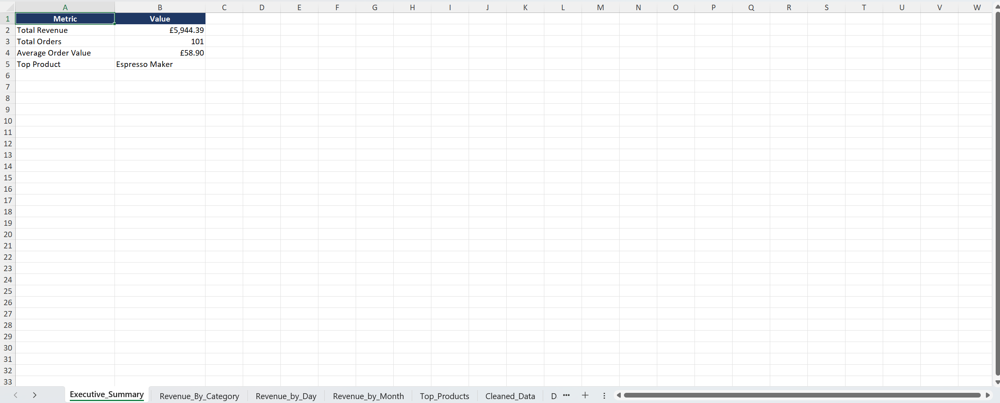
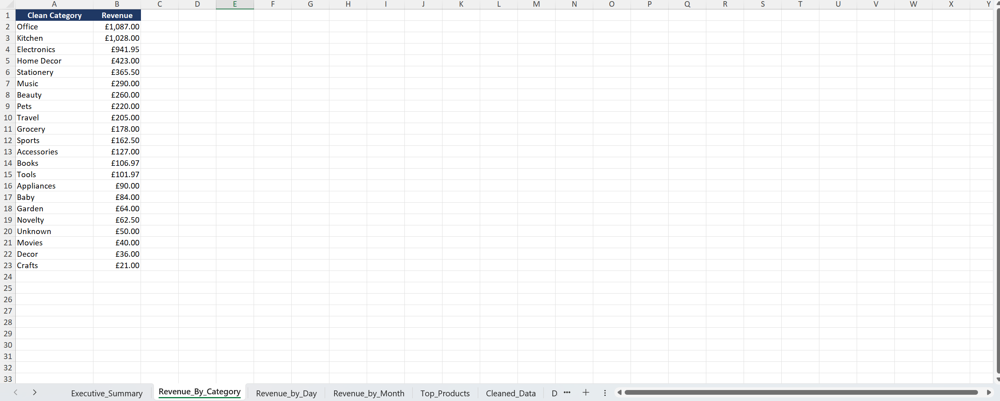
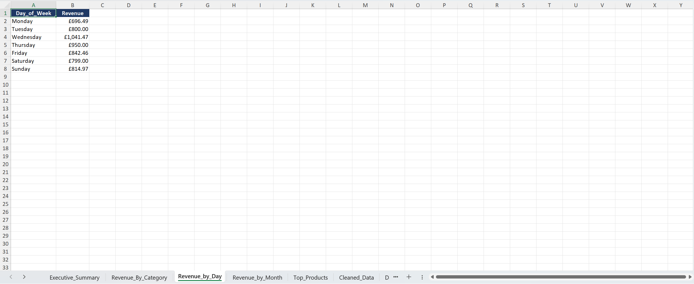
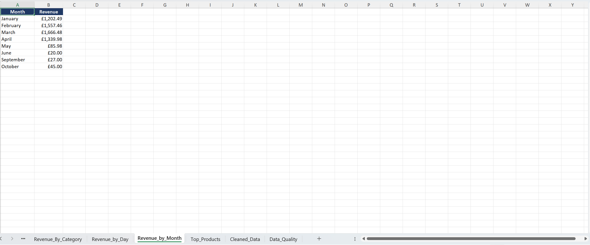
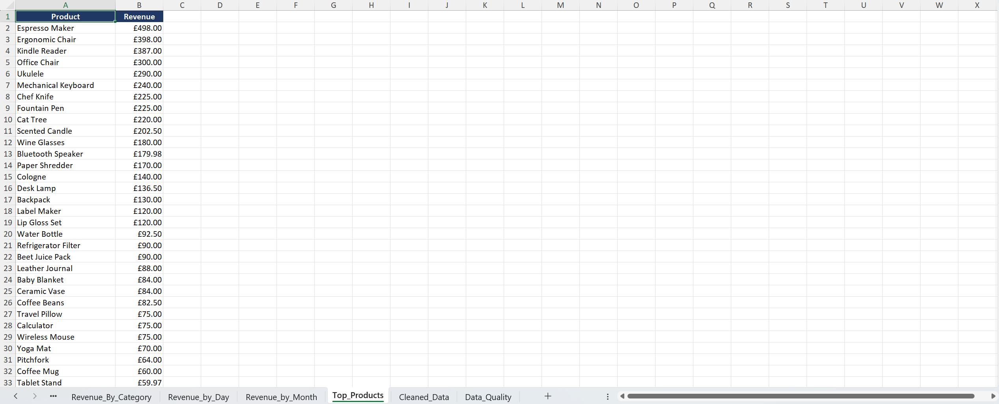
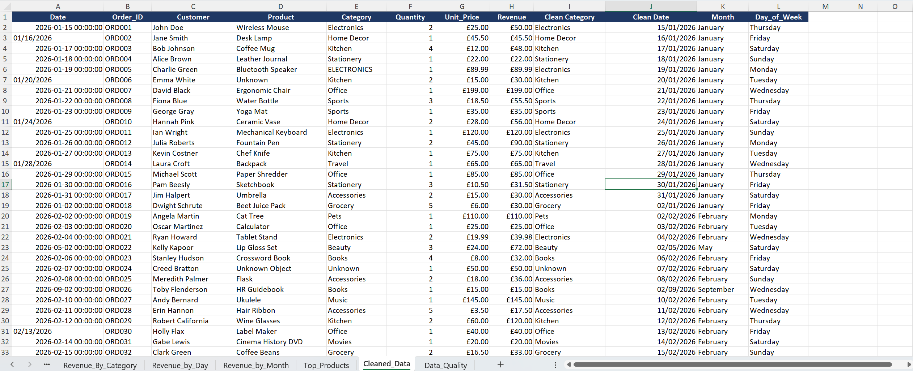
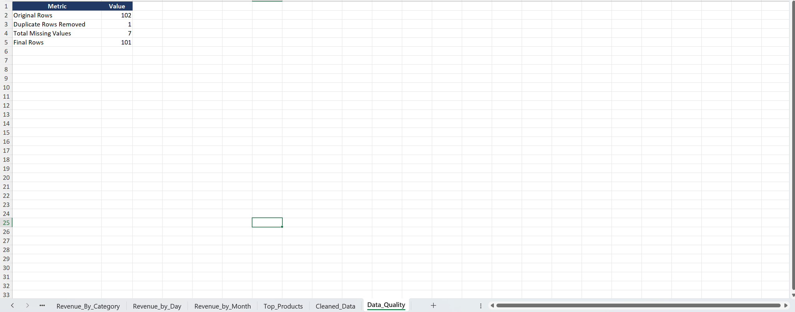

# Automated Report System

## Overview

An automated report system that transforms raw data into clean, structured reports. The system cleans and standardises input data, performs analysis, generates management summaries and exports the results into a formatted Excel workbook.

## Features

- Cleans raw data removing duplicates, standardising dates, and handling missing values.
- Generates multiple summary sheets analysing revenue by different categories, months, and days of the week.
- Exports a formatted Excel file with separate reporting sheets.
- Produces an executive and terminal summary highlighting key business metrics such as best-performing month, total revenue and more.

## Background

Businesses often export raw sales data from different systems, but these exports are rarely ready to share with management. Therefore, the data needs to be cleaned, organised and analysed before significant insights can be drawn. This project was designed to automate that reporting workflow by transforming raw sales data into structured, business-ready reports, requiring minimal manual intervention.

## Technologies Used

- Python
- Pandas
- OpenPyxl
- Excel

## Requirements

- Python 3.11+
- pandas
- numpy
- openpyxl

## How to Run

1. Ensure Python and the required libraries are installed.
2. Place the input Excel file (raw_sales_data.xlsx) in the project directory (or provide it as a command-line argument).
3. Run the script:
	Python Auto_Report_System.py
4. The generated, formatted Excel report will be saved automatically.

## Output

The generated workbook includes:

- Executive Summary
- Revenue by Category
- Revenue by Month
- Revenue by Day
- Top Products
- Cleaned Data
- Data Quality Summary

## Screenshots

### Executive Summary

### Revenue by Category

### Revenue by Day

### Revenue by Month

### Top Products

### Cleaned Data

### Data Quality Summary

